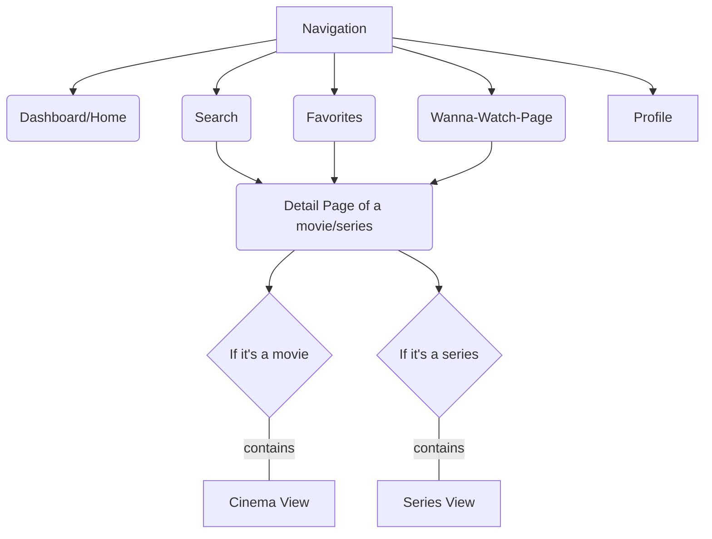

# Planned Pages

[comment]: <> (Main Pages)
## Dashboard/Home
The front page of the website contains movie recommendations etc.

## Search
This is the place where you can search for new movies and series.
If you see something you like you can add it to your watchlist, mark it as a favorite or see more details about it.

## Favorites
This is the page where you can manage your favorite movies or series. You can see which of them are now in cinema etc and you can remove them from your favorite-list.

## Wanna Watch Page
This view contains a list of movies/series the user would like to watch at some point.

## Profile
This is the place where the user can manage the settings, Login-Info etc.

[comment]: <> (Sub-Pages)
## Detail Page
The detail view contains more infos about the movie/series like for example the duration, recommendations and ratings.

## Cinema View
Contains infos about when the movie will be shown in which cinema. This will also allow you to mark the movie as watched.

## Series View
The series view is a list of seasons and episodes. You will be able to mark each episode when you have watched it. There will also be a button to reset the whole series to "not watched" so you don't have to click for each episode.

